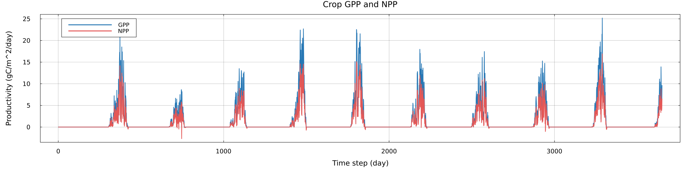

# Agrocosm.jl

[](https://github.com/yunan-l/Agrocosm.jl/actions/workflows/CI.yml?query=branch%3Amain)
[](https://yunan-l.github.io/Agrocosm.jl/dev/)

**🧑‍🌾 💧 ☀️ 🌾 🚀 Fast and flexible Julia framework for agricultural ecosystem modelling across scales.**

Agrocosm.jl is a framework for building a new generation of
process-based crop models. Technically it is a crop-soil model with water, carbon, nitrogen, and energy processes with a numerical design that can run on both CPUs and GPUs. It is easy to use and easy to extend. It is written in Julia to make physically based
simulation, differentiable programming, high-performance computing, and
machine-learning workflows available within one modelling environment.

The present implementation takes the crop module of
[LPJmL](https://github.com/PIK-LPJmL/LPJmL) as an scientific
reference. Agrocosm is **not** a line-by-line port of LPJmL. It is an
independent Julia implementation that preserves relevant process
logic while developing a GPU-aware and increasingly
differentiable model architecture.

> [!WARNING]
> Agrocosm.jl is under active development, but almost done as a standalone model.

Read the [online documentation](https://yunan-l.github.io/Agrocosm.jl/dev/)
for installation, model concepts, input schemas, CPU/GPU execution,
checkpoints, validation scope, and API reference.

## Vision

We want Agrocosm to be:

- **Fully GPU-compatible**, from a single site to large ensembles of grid cells
- **Differentiable**, enabling gradient-based calibration,
  sensitivity analysis, data assimilation, and hybrid modelling
- **Process-based and auditable**, with explicit carbon, nitrogen, water, and
  energy balance diagnostics
- **Modular and extensible**, comparing alternative process representations
  without rebuilding the full model
- **Open and community-oriented**, providing a foundation that can incorporate
  new crop physiology and collaborate with the wider crop-modelling community.

Agrocosm keeps an independent crop-model architecture, while aiming to remain suitable for
future coupling with land and Earth system modelling frameworks.

## Current scope

Agrocosm currently focuses on daily, gridded simulations of a single crop.

<table>
  <thead>
    <tr>
      <th>Model component</th>
      <th>Subsystem</th>
      <th>Current implementation</th>
    </tr>
  </thead>
  <tbody>
    <tr>
      <td rowspan="2" align="center" valign="middle"><strong>Crop</strong></td>
      <td>Carbon and nitrogen</td>
      <td>C3/C4 photosynthesis, carbon allocation, and respiration; nitrogen allocation and uptake.</td>
    </tr>
    <tr>
      <td>Phenology and management</td>
      <td>Canopy growth, phenology; cultivation, fertilizer, harvest, and residue transfer.</td>
    </tr>
    <tr>
      <td rowspan="2" align="center" valign="middle"><strong>Soil</strong></td>
      <td>Physics</td>
      <td>Five-layer soil water, snow, temperature, freeze--thaw, and water/energy transport.</td>
    </tr>
    <tr>
      <td>Biogeochemistry</td>
      <td>Litter routing; coupled soil C--N decomposition; mineralization, immobilization, nitrification, denitrification, volatilization, and leaching.</td>
    </tr>
    <tr>
      <td align="center" valign="middle"><strong>Numerics</strong></td>
      <td>Backend and precision</td>
      <td>CPU/GPU kernels via <a href="https://github.com/JuliaGPU/KernelAbstractions.jl">KernelAbstractions.jl</a>, <code>Float32</code>/<code>Float64</code> support.</td>
    </tr>
  </tbody>
</table>

## What Agrocosm is not yet

The following are planned, but not yet part of the current model:

- **Near-term:** ecosystem spin-up and broader management processes.
- **Next model generation:** multi-crop stands, rotations, and dynamic sowing.
- **Long-term:** end-to-end differentiable process pathways, global validation, and hybrid process--machine-learning applications.

## Installation

Agrocosm is not yet registered in the Julia General registry. Clone the source
and instantiate its project environment:

```bash
git clone https://github.com/yunan-l/Agrocosm.jl.git
cd Agrocosm.jl
julia --project=. -e 'import Pkg; Pkg.instantiate()'
```

A NVIDIA GPU and a working [CUDA.jl](https://github.com/JuliaGPU/CUDA.jl) installation are needed only for GPU execution and GPU tests.

## Quick start

The repository includes initial conditions and ten years of daily forcing in
`examples/`. From the repository root:

```julia
using Agrocosm
using JLD2

initial_data = load("examples/initial_wheat.jld2", "initial_data")
climate = load("examples/climate_2000_2009.jld2", "climate")

simulation = initialize_simulation(
    cft1, initial_data;
    indices = [1],
    device = identity,
    T = Float32,
    days = size(climate.temp, 1),
    fertilizer = :yes,
)

run_simulation!(simulation, climate)
summary = simulation_summary(simulation)
```

The ten-year GPP and NPP simulations see below:
<p align="left">
  
</p>

For a GPU simulation, construct inputs on the GPU or set `device = CuArray`
when calling `initialize_simulation`. The same process code is designed to run
over a batch of independent grid cells; `indices = [1]` selects one input grid
cell, while a longer index vector selects a larger batch.

<!-- Save at any completed daily boundary and resume into a newly initialized
simulation with the same precision, dimensions, and run options:

```julia
save_checkpoint("wheat_checkpoint.jld2", simulation)
resumed = initialize_simulation(
    cft1, initial_data;
    indices = [1], device = identity, T = Float32,
    days = 10*365, fertilizer = :yes,
)
restore_checkpoint!(resumed, "wheat_checkpoint.jld2")
run_simulation!(resumed, remaining_climate; spinup = false)
```
-->

## Testing

Run the CPU test suite with:

```bash
julia --project=. test/runtests.jl
```

GPU tests are separate because they require a functional CUDA device. For
example:

```bash
julia --project=. test/simulations/test_daily_crop_C3_precision_gpu.jl
julia --project=. test/processes/soil/test_soil_process_kernels_gpu.jl
```

## Long-term goals

The detailed development plan is maintained in the [project roadmap](docs/roadmap.md).

When the roadmap is complete, Agrocosm should support:

- Large-domain, high-resolution crop simulation on both CPUs and GPUs
- Gradient-based calibration of cultivar and physiological parameters
- Assimilation of remotely sensed LAI, GPP, evapotranspiration, and biomass
- Combining Agrocosm with data-driven models to surpport hybrid modelling
- Sensitivity analysis of climate change and crop management strategies

## Contributing

Contributions, ideas, issue reports, and process-comparison experiments are
very welcome. Agrocosm is most useful when crop physiologists, Earth system
modellers, numerical scientists, and machine-learning researchers can inspect,
question, and improve its assumptions together. Please open a GitHub issue to
start a discussion.

## Acknowledgements

Agrocosm.jl is a research project developed with the support of the
[Earth System Modeling group](https://www.asg.ed.tum.de/esm/home/) at the Technical
University of Munich (TUM) and the
[FutureLab on Artificial Intelligence](https://www.pik-potsdam.de/en/institute/departments/complexity-science/research/artificial-intelligence)
at the Potsdam Institute for Climate Impact Research (PIK). The author
acknowledges funding from the China Scholarship Council (grant agreement
no. 202303250017) and the Horizon Europe ClimTip project (grant agreement
no. 101137601).

## License

Agrocosm.jl is released under the [European Union Public Licence v1.2](https://eupl.eu/1.2/en). You are encouraged to copy, modify, and build upon our code to advance your research. 
